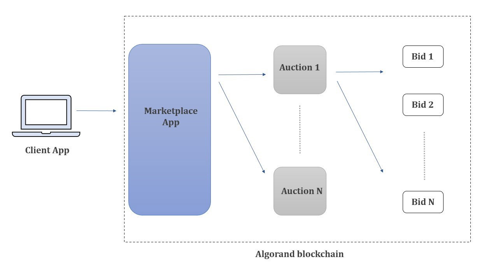

# Algorand School Project

## Group G4: 
1. Uroš Hudomalj - https://github.com/uhudo
2. Fadi Barbara - https://gihub.com/disnocen
3. Akshay Kant - https://github.com/akshaykant

*Project Name: Decentralized Auction marketplace*

## Goal 

The end-goal of the project is to create a NFT auction manager (NAM) based on the contracts presented [at the school](https://github.com/algorand-school/handson-contract). NFT sellers deploy and manage auctions through the NAM, while bidders can interact with the currently-active auction by sending specific bids through the NAM.

Of course, the management of auctions is part of some solutions already deployed (see the [State of the art](#state-of-the-art) section). On the other hand, those are *ad hoc* solutions and it is not easy to deploy them separately from the market itself. This creates a network effect that *de facto* increases the centralization of the markets to a handful of competitors that can easily create a monopoly (or oligopoly) and [threat the opennes of the environment](https://www.fon.hum.uva.nl/rob/Courses/InformationInSpeech/CDROM/Literature/LOTwinterschool2006/szabo.best.vwh.net/ttps.html). We argue that this scenario would hinder blockchain's potential at the detriment of the end-users.

To mitigate this problem, we aim to create a service that specifically addresses *only* the management of auctions. We believe that this service could be an important tool in the decentralization of markets (at least of those related to NFTs): it simplifies the sale of assets, from the seller's point of view, removing friction and opening the creation of many (possibly smaller) online markets.

## State of the art
Auctions have been around for [more than 2500 years](https://www.econport.org/content/handbook/auctions/historyofauctions.html). Through the course of history many things have changed, of course, but since the practice is so ingrained into the human history it is no surprise that auctions are also a conspicuous part of the blockchain ecosystem.

Many examples can be made, from the [Maker Protocol's auctions](https://docs.makerdao.com/keepers/the-auctions-of-the-maker-protocol#auctions) for *surplus* and *collateral* of (fungible) tokens, to the [Flashbots' auctions](https://docs.flashbots.net/Flashbots-auction/overview/) for a fairer Miner Extractable Value (MEV).
On the other hand, other forms of auction can be seen in NFTs, which (at least in their first iteration) represent a form of scarcity in digital art. 

There are several NFT marketplaces that allow the exchange of assets, including (but not limited to) via auctions. Some of the most popular markets include [OpenSea](https://opensea.com) (on Ethereum) and [AlgoGems](https://www.algogems.io/) (on Algorand), but there are no _specific_ auction managers.

Since the technology around NFTs creation and trading is rapidly evolving, it is normal not to find peer-reviewed papers on the subject. As of now, the most updated resources are scattered between blog posts and group chats. In particular, the [blog post from a16z](https://a16zcrypto.com/how-auction-theory-informs-implementations/) may be used as an updated (October 7th, 2022) survey for the subject. In particular, the authors of the post clearly explain how different kind of auctions can be implemented based on the needs of the users (both sellers and bidders)

## Smart Contract Specifications
There are three smart contracts. Each of them is an improvemnt over the original contracts presented in the school. In particular
- Normal Auction contract in the directory [AuctionContract](./AuctionContract)
- Sealed Auction contract in the directory [SealedAuctionContract](./SealedAuctionContract)
- Sealed Overcollateralized Auction contract in the directory [SealedOvercollateralizedAuction](./SealedOvercollateralizedAuction)

In the following we provide a specification of the main functions of the contracts.

### Normal Auction Contract

The contracts have some common functions. The most important are:

- The `create_app` function creates the auction function:
```python
def create_app(seller: abi.Account, nftID: abi.Uint64, startRound: abi.Uint64,
endRound: abi.Uint64, reserve: abi.Uint64, minBidIncrement: abi.Uint64,
serviceFee: abi.Uint64, *, output: abi.String) -> Expr:
```
- The `closeAccountTo` function uses the [CloseRemainderTo](https://developer.algorand.org/docs/get-details/transactions/transactions/#payment-transaction) field of `pay` transactions to give the creator of the auction the service fee
- The `on_bid` function is used to bid
- The `paySeller` function that explicitly pays the seller; used to independently claim the coins
- The `payWinner` function that explicitly pays the winner; used to independently claim the coins

### Sealed Contract
Beside the functions listed in the [previous section](#common-function), the sealed contract has 
- the `on_commit` function used to place the commitment before the bidding

### Overcollateralized Contract


## Modifications
We improved upon the NFT auction smart contract (https://github.com/algorand-school/handson-contract) by improving some functions and creating new ones. In particular, we maintained two contracts: one which supports sealed bids and one without.

In the following we list the specific changes we made to the contract

### Improvements

This is a list of improvement with respect the original contract. For both the ordinary and sealed-type, we:

- modified the tracking of time from timestamp to rounds: this way we use the blockchain inner clocking mechanism and we are not subject to subjective changes in the participants' watches
- individual claiming: seller and the winner can independently claim funds (e.g. without winner blocking the seller by not opting in the NFT) 
- check of dynamic datatypes according to ABI guideline recommendations

For sealed-type we made some specific improvements too:
- improved obfuscation with a `nonce`: the goal is to avoid a [rainbow attack](https://en.wikipedia.org/wiki/Rainbow_table)
- code optimization - removing unnecessary check (`start<commit` and `commit<end`, where it was unnecessary to check `start<end`, etc.)

### New Features Implemented

We added new features into the smart contracts. Please see [this feature rationale](./FEATURES.md) for more details into the choice we made about them.

- Service fees: it is possible to take a fee for the creator of the auction from the winning bid. The fee is computed as a percentage of the winning bid. If no service fee is required, it is possible to set to `0` the `serviceFee` variable. 
- Overcollateralization: we give the possibility to lock up more ALGOs than their bid value itself requires. This way an observer can only learn an upper bound of a bid’s value, increasing privacy for the bidder while preventing spamming and stair bidding.
- Vickrey auction: similar to sealed-bid auction, except the winner pays the value of the second-highest bid 


### Future features
- Marketplace 
- Dutch auction 

## Proof of Concept and Testing

We provide the templates of auctions as specified in the previous section. For each template, we provide a python script whose function is twofold. On the one hand it acts as a test case and use case of the contract itself. On the other hand it can be used as a documented code and brief tutorial on how to use the template. 

More details on this subject can be found on the [dedicated file](./NOTES.md). Each contract has a log of the transaction on the public testnet as proof of working, for example [this one](https://testnet.algoexplorer.io/tx/7QHRGXTWDCP4EWZU4ISZKXQBAWG2RKZKUNGGKPQ4J4XJLIQOPYPA) from the Sealed Overcollaterized Auction, test-case demo 1.


## Business Benefits

As we mentioned in the [Goal Section](#goal), our goal is to create a NFT Auction Manager (NAM). This has big business benefits with respect to the decentralization that such a service would provide for asset-trading. 

We envision a structure similar to the image below:

|  | 
|:--:| 
| *Design of the NAM. See <https://akshay-kant.medium.com/decentralised-marketplace-ca8e37655c64> for more details* |

A user (either bidder or seller) can use the application to spawn a new auction that follows one of our templates and use the same app to manage the bidding process itself. More details on the business side of the completed manager can be found in [this post](https://akshay-kant.medium.com/decentralised-marketplace-ca8e37655c64) written by one of us.

By focusing on the auction process and management themselves, without dealing with other accessory processes, we claim it would be easier to [avoid auction bugs](https://twitter.com/0xInuarashi/status/1517674505975394304) which can impact both sellers and bidders.
